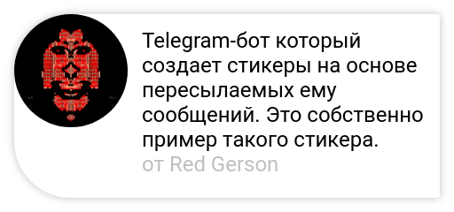

# Telegram Quote Bot
[🇷🇺 ru translation](README.ru.md)

This is a Telegram bot that creates stickers based on messages forwarded to it.



## How does it work?

Headless-Chrome and Selenium are used to draw stickers, allowing you to create beautiful stickers of any complexity using HTML, CSS, and even JavaScript.

## How does it run?

To run the bot, you need to install Docker and follow the instructions below.

1. Clone the repository
2. Copy the template environment file
    ```shell
    cp ./docker/.env.template ./docker/.env
    ```
3. Edit the `./docker/.env` file and add your bot token:
    ```shell
    $ cat ./docker/.env
    TOKEN=INSERT_TOKEN_HERE
    ```
4. Start the bot
    ```shell
    make start
    ```
   This runs the bot in the background.
5. Done, you can now forward messages to your bot
6. To stop the bot, run:
    ```shell
    make stop
    ```

## How to customize?

- You can edit `quote.html` to change the design of the sticker
- You can change `font.ttf` to modify the sticker's text font
- You can replace `avatar-placeholder.png` to change the user's avatar stub when it cannot be obtained

You can also put your files in the `./override/` folder to avoid modifying files tracked by the version control system.
